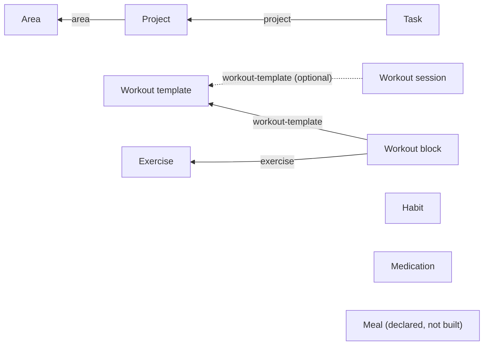

# RKA OS Mobile — Data Schema

One SQLite database (`rka-os.db`), one master table per concept, plus a generic relations table — the Notion-database model: every "add" is a row in `items`, typed by `type`; cross-entity links live in `itemRelations`; every screen (Areas, Projects, Tasks, Medications, Calendar, ...) is a filtered/grouped **view** over these same tables, not its own store.

This file is the source of truth for the schema. Update it whenever `src/db/database.ts`'s `initSchema()` or an entity's `metadata` shape changes. For a live, clickable version of this same schema (with a form to propose new relations), ask Claude to show the interactive entity-schema widget in chat.

> **Naming note:** the `type` discriminator, column names, `relationType` values, and identifiers throughout the codebase (`ItemType`, `getRelation(id, 'area')`, `AreasScreen.tsx`, `getProjectItemCount`, etc.) all use the literal words **`area`** and **`project`** — these are internal/code names and are never renamed. Every *user-facing* string, however, must say **"Domain"** (for `area`) and **"Mission"** (for `project`) instead — this is an established product-vocabulary decision, not a bug. If you're adding a new screen, alert, label, or empty-state copy that surfaces an area/project entity to the user, use "Domain"/"Mission", not "Area"/"Project".

## Relation graph

Each arrow is one `itemRelations` edge, labeled with its `relationType` — read `Task -- project --> Project` as "a task relates to a project via relationType `'project'`". The unconnected nodes (Habit, Medication, Meal) have no relations wired up yet — they're independent rows in `items` today.

## Tables

### `items` — the master table

Every entity type (`area`, `project`, `task`, `habit`, `medication`, `workout-template`, `workout-block`, `exercise`, `workout-session`, `meal`, `potential-stat`, `achievement`, `focus`, `routine`, `routine-step`, `routine-session`, `skill`, `backward-plan`) is a row here, discriminated by `type`.

Startup-critical item list queries are indexed by status/type plus `deletedAt` and `createdAt DESC`; Home, badge counts and Inbox call these during launch, so keep those indexes aligned with the query shapes. Home's secondary Today-adjacent tabs (Upcoming/Anytime/Someday/Logbook) are intentionally lazy-loaded after selection, and Logbook uses the completedAt/updatedAt index instead of a `COALESCE` sort.

| Column | Type | Notes |
|---|---|---|
| `id` | TEXT PK | uuid |
| `type` | TEXT | entity type discriminator |
| `title` | TEXT | display name |
| `status` | TEXT | `inbox` \| `active` \| `someday` \| `scheduled` \| `due-today` \| `overdue` \| `completed` \| `skipped` \| `archived` \| `cancelled` |
| `notes` | TEXT? | free-form notes |
| `voice_transcript` | TEXT? | original voice capture, pre-edit |
| `scheduledDate` | TEXT? | `YYYY-MM-DD` |
| `dueDate` | TEXT? | `YYYY-MM-DD` |
| `rrule` | TEXT? | recurrence rule (not yet used by any type in practice) |
| `metadata` | TEXT? | JSON blob, shape is type-specific — see below |
| `createdAt` / `updatedAt` | INTEGER | epoch ms |
| `userId` | TEXT? | reserved for multi-user/sync |
| `archivedAt` / `deletedAt` | INTEGER? | soft-delete/-archive markers |

An item is captured "unclassified" by defaulting to `type='task'`, `status='inbox'` — classification means `processInboxItem()` changing `status` (and, for Project/Area/Habit/Medication destinations, `type` too).

### `itemRelations` — generic single-select relations

The Notion "relation property" equivalent. One row per `(sourceId, relationType)` — each source has at most one target per relation type (single-select, not multi-relation).

| Column | Type | Notes |
|---|---|---|
| `id` | TEXT PK | uuid |
| `sourceId` | TEXT | the item pointing at another (e.g. a task) |
| `targetId` | TEXT | the item being pointed at (e.g. a project) |
| `relationType` | TEXT | e.g. `'project'`, `'area'` |
| `createdAt` | INTEGER | epoch ms |

API (`src/db/database.ts`): `setRelation(sourceId, relationType, targetId \| null)`, `getRelation(sourceId, relationType)`, `getRelatedItems(targetId, relationType)`, `countRelated(targetId, relationType)` — the rollup primitive.

Currently used relations:
- `project -> area` (relationType `'area'`)
- `task -> project` (relationType `'project'`)
- `workout-block -> workout-template` (relationType `'workout-template'`)
- `workout-block -> exercise` (relationType `'exercise'`)
- `workout-session -> workout-template` (relationType `'workout-template'`, optional — only set for template-started sessions)
- `potential-stat -> area` (relationType `'potentialStatArea'` — deliberately NOT `'area'`, so Potential Stats never leak into `getRelatedItems(areaId, 'area')`/`getAreaProjectCount`, which are Mission-specific)
- `achievement -> area` (relationType `'achievementArea'`, same reasoning — kept out of Mission rollups)

### `itemInstances`, `activityLogs`, `appSettings`

Supporting tables, not part of the entity/relation model: `itemInstances` tracks per-day scheduling instances of recurring items; `activityLogs` is an audit trail (dose logs, status changes); `appSettings` is a flat key-value store.

`activityLogs` is indexed for both entity-scoped history (`entityId`, `actionType`, `timestamp DESC`) and action-wide recency scans (`actionType`, `timestamp DESC`), because medication timers and recent logs run during app startup and must not full-scan the growing audit trail.

### `dailyCheckIns` — Morning Check-In / Evening Debrief logs

Dedicated structured daily-log rows, deliberately separate from `items` so check-ins never become tasks and never affect Today completion. Each local date can have at most one row per phase.

| Column | Type | Notes |
|---|---|---|
| `id` | TEXT PK | uuid |
| `dateKey` | TEXT | local date, `YYYY-MM-DD`; Evening Debrief opened between midnight and 2:00 AM attaches to the previous local date |
| `phase` | TEXT | `'morning'` \| `'evening'` |
| `answers` | TEXT | JSON `DailyCheckInAnswers` from `src/utils/dailyCheckIn.ts`: structured chip values, notes, priority snapshots and evening outcomes |
| `createdAt` / `updatedAt` | INTEGER | epoch ms |

API (`src/db/database.ts`): `upsertDailyCheckIn`, `getDailyCheckIn`, `getDailyCheckInsForDate`, `getDailyCheckIns`. Saving a check-in writes only this table. It must not update task status/order/schedule, Potential, Domain scoring, Focus weights, habit streaks, routine sessions, or achievements. Linked priorities store a title snapshot plus optional `taskId`/reason/outcome so history stays readable if the task is renamed, archived, completed or deleted later.

### `domainContributions` — live Domain scoring effects

One row per completion-event's *current, decaying* effect on a Domain's score — kept deliberately separate from the permanent `items` rows (`project`, `achievement`) that record history, so the scoring formula/defaults can be re-tuned, or one contribution soft-disabled, without ever touching that history. See `src/utils/domainScoring.ts` for the decay/lift math and `src/db/database.ts`'s `completeMission`/`setMissionAchievementEligible`/`computeDomainScore` for how rows here get created and read.

| Column | Type | Notes |
|---|---|---|
| `id` | TEXT PK | uuid |
| `areaId` | TEXT | the Domain this contribution affects |
| `sourceType` | TEXT | `'mission'` \| `'achievement'` |
| `sourceId` | TEXT | id of the `project` or `achievement` item that produced this contribution |
| `magnitude` | REAL | base strength at `occurredAt`, as a fraction of `MAX_ACHIEVEMENT_LIFT` (0..1) |
| `halfLifeDays` | REAL | decay half-life |
| `occurredAt` | INTEGER | epoch ms the decay clock starts from — the Mission's *original* completion date, even across achievement-eligibility upgrades/downgrades |
| `excludedAt` | INTEGER? | soft-disable timestamp (NULL = active). Never deleted — same convention as `archivedAt`/`deletedAt` on `items` |
| `createdAt` | INTEGER | epoch ms |

At most one row is active per completion event: completing a Mission creates exactly one (Mission-tier for ordinary Missions, Achievement-tier instead-of for `achievementEligible` ones — never both). Toggling `achievementEligible` after completion excludes one tier's row and reactivates/creates the other, always preserving the original `occurredAt`.

### `planBlocks` / `planBlockSteps` — Plan Backwards plan components

Not part of the `items`/`itemRelations` model — a plan's ordered components (Routine/Task/Travel) are plan-instance-specific (placement, buffer, completion) and must never leak back into a reusable `routine` template, so they're dedicated tables rather than `items` rows. Owned by one `backward-plan` item via `planId`.

| Table | Column | Type | Notes |
|---|---|---|---|
| `planBlocks` | `id` | TEXT PK | uuid |
| | `planId` | TEXT | the owning `backward-plan` item |
| | `type` | TEXT | `'routine'` \| `'task'` \| `'travel'` |
| | `title` | TEXT | |
| | `orderIndex` | INTEGER | manual order within the plan |
| | `placement` | TEXT | `'auto'` \| `'anytime-before'` \| `'keep-near-event'` |
| | `bufferMinutes` | INTEGER? | reserved but not shown as a fake task |
| | `durationMinutes` | INTEGER? | task/travel manual estimate (routine blocks derive duration from their steps) |
| | `actualMinutes` | INTEGER? | reserved for future duration learning |
| | `routineTemplateId` | TEXT? | the `routine` item this block was instantiated from (routine blocks only) |
| | `linkedItemId` | TEXT? | optional existing `task` item this block represents |
| | `completedAt` | INTEGER? | task/travel completion; routine blocks derive completion from their steps |
| | `travelConfig` | TEXT? | JSON `TravelConfig`: `{ startLocation?, destination?, mode, durationMinutes, bufferMinutes?, source?, distanceMeters?, estimatedAt? }`. `source: 'live'` means `durationMinutes` came from a real Apple Maps ETA (`src/services/appleMaps.ts` — see below); editing any travel input afterward resets it to `'manual'`, never left stale. |
| | `notes` | TEXT? | |
| `planBlockSteps` | `id` | TEXT PK | uuid |
| | `blockId` | TEXT | the owning `planBlocks` row (`type='routine'`) |
| | `templateStepId` | TEXT? | soft, non-live reference back to the `routine-step` item it was copied from |
| | `title` / `estimatedMinutes` / `actualMinutes` | | copied from the template at add-time, then independent |
| | `orderIndex` / `placement` / `completedAt` | | plan-instance-specific, never written back to the template |

API (`src/db/database.ts`, "Plan Backwards" section): `createBackwardPlan`, `getBackwardPlans`/`getBackwardPlan`, `updateBackwardPlan`, `deleteBackwardPlan`, `addPlanBlockRoutine` (copies the routine template's current steps — a snapshot, not a live link), `addPlanBlockTask`, `upsertPlanBlockTravel`/`getTravelBlockForPlan` (Travel is a single toggleable feature per plan, not repeatable like Routine/Task — upsert finds-or-creates the plan's one travel block rather than always inserting; writes `durationMinutes`/`bufferMinutes` to both the row's own columns AND inside `travelConfig`, since the generic block-duration math only reads the row columns), `updatePlanBlock`/`deletePlanBlock`, `getPlanBlocks`, `togglePlanBlockComplete`/`togglePlanBlockStepComplete`, `reorderPlanBlocks`/`reorderPlanBlockSteps`, `getDefaultDeparturePoint`/`setDefaultDeparturePoint` (a plain `appSettings` key). Pure time-budget math lives in `src/utils/backwardPlanCalc.ts` (`calculateTimeRemaining`, `calculateRoutineRemainingDuration`, `calculatePlanRequiredDuration`, `calculateUnallocatedTime`, `calculateLeaveBy`, `buildBackwardsSchedule`) — see its tests for the completed-step-exclusion and backwards-ordering behavior.

## Entity type reference

| Type | Status | Type-specific `metadata` fields |
|---|---|---|
| `area` (user-facing: **Domain**) | built | none yet |
| `project` (user-facing: **Mission**) | built | none yet (area link lives in `itemRelations`, not metadata) |
| `task` | built | `gtdContext` (`today`\|`morning`\|`evening`\|`someday`\|`project`\|`area`\|`habit`\|`medication`\|`reference`), `timeOfDay` (`morning`\|`evening`) |
| `habit` | built | `gtdContext` (set to `'habit'` on triage). Quantified habits additionally store a `HabitMeta` blob in `metadata` (see `src/utils/habitMeta.ts`): `{ intent: 'build'\|'quit', measurement: 'binary'\|'count'\|'duration', targetValue, targetUnit?, targetPeriod: 'daily'\|'weekly'\|'monthly'\|'custom', customPeriodDays?, contextualAction: 'mark-done'\|'add-one'\|'enter-value', potentialStat?, potentialTargetDays? }`. Missing/malformed metadata defaults to binary/daily/mark-done, so every pre-existing habit is unaffected. Manual samples for count/duration habits are `'habit-sample'` `activityLogs` rows (`entityId` = habit id, `details: {value, note?}`); period progress is always recomputed from these events, never a stored running total. Undo removes the most recent sample. |
| `routine` | built | none (routine metadata lives on its steps) |
| `routine-step` | built | `RoutineStepMeta` (see `src/utils/routineMeta.ts`): `{ durationSeconds?, autoAdvance, instructions? }`; step order is the app's shared manual-order table (`itemOrder`, listKey `routine:<routineId>`), not a metadata field |
| `routine-session` | built | `RoutineSessionMeta`: `{ currentStepIndex, stepStartedAt, elapsedBeforePauseMs, status: 'running'\|'paused', stepOverrides? }`. Remaining step time is always derived from these persisted timestamps (`computeStepRemainingSeconds`), never a local counter, so it is correct immediately after backgrounding or a full relaunch. Step transitions are logged as `activityLogs` rows (`'routine-step-completed'`\|`'routine-step-skipped'`). **Never writes to `domainContributions` and never sets `potentialStat`** — only a linked habit's own maintenance math may affect Potential, so finishing a routine never double-counts. A session can be abandoned via `cancelRoutineSession` (sets `items.status = 'cancelled'`), which `getActiveRoutineSession`'s `status = 'active'`-only query already excludes — the escape hatch for a session with no steps to play (Play is hidden on zero-step routines) or one the user no longer wants to resume. |
| `medication` | built | `dose`, `stockRemaining` (derived total, see Packaging below), `initialStock`, `refillThreshold`, `lastTakenAt`, `maxPerDay`, `minHoursBetweenDoses`, `frequency`, `containerLabel`, `containerSize`, `containersPerRestock`, `sheetsPerContainer`, `pillsPerSheet`, `packagingNote`, `containers[]` |
| `workout-template` | built | none yet |
| `workout-block` | built | `sets`, `reps`, `weight`, `restSeconds`, `notes` |
| `exercise` | built | `muscleGroup`, `equipment`, `movementFamily` (one of the 32 canonical parent movement ids), `notes`, `imageKey`; legacy/custom rows without `movementFamily` are classified from their title at read time |
| `workout-session` | built | none (sets are logged as `activityLogs` rows, `actionType: 'workout-set-logged'`, `entityId` = exercise id, `details`: `{sessionId, setNumber, reps, weight, weightUnit}`) |
| `meal` | declared, not built | — |
| `potential-stat` | built | `seedKey` (only on the 4 legacy-migrated defaults — Physique/Skin/Oral Hygiene/Vitality) |
| `achievement` | built | `earnedAt` (YYYY-MM-DD, the real date — separate from `createdAt` so retrospective/backdated trophies don't inflate current Potential), `source` (`'mission'` \| `'milestone'` \| `'manual'`), `sourceId` (originating Mission/milestone item id, if auto-created), `contributesToScore` (boolean — `false` = display-only trophy, no `domainContributions` row; toggling this after creation must go through `setAchievementContributesToScore`, which is the only thing that actually creates/reactivates/excludes the `domainContributions` row — the flag alone does nothing) |
| `focus` | built | `weights` (`Record<areaId, number>`) — singleton row (title = the focus label); absence means equal (1x) weighting for every Domain |
| `skill` | built | `proficiency` (0-100, manual rating — never derived), `secondaryAreaIds` (`string[]`, plain array — not `itemRelations`, since a skill can have several secondary Domains and `itemRelations` only supports one target per `(sourceId, relationType)`). Primary Domain is a real relation, `skillArea`. Habits/routines/missions link via `habitSkill`/`routineSkill`/`missionSkill` (organizational only — no scoring effect). Milestones link via `achievementSkill` (mutually exclusive with `achievementArea` on the same achievement); a milestone marked `contributesToScore` writes `sourceType: 'skill'` `domainContributions` rows (`SKILL_CONTRIBUTION_DEFAULTS`: magnitude 0.3, halfLife 45d — smaller than Mission/Achievement tiers) at full weight on the primary Domain and half weight on each secondary Domain. This is the ONLY path from a Skill to Domain scoring — linked habits/routines/missions keep contributing solely through their own existing channel, never double-counted through the Skill layer. |
| `backward-plan` | built | Plan Backwards anchor event. `title`/`scheduledDate`/`notes` use the standard item columns; `metadata` is `BackwardPlanMeta` (`src/utils/backwardPlanMeta.ts`): `{ goalTime, startTime?, expectedTime?, latestTime?, endTime?, location?, deviceCalendarEventId? }` — all times `'HH:MM'` 24h strings. Only `goalTime` is required; it is deliberately distinct from `startTime` (an event's official start is not the same as the user's personal Goal Time to be there). `deviceCalendarEventId` is a read-only reference into the device calendar (`src/services/deviceCalendar.ts`) — never written back to. The plan's ordered components live in `planBlocks`/`planBlockSteps` (see above), never as `items` rows. |

`project` also gains a `metadata.achievementEligible` boolean (default `false`) — set at any time, before or after completion, and read at completion time to decide whether completing the Mission creates a permanent `achievement` trophy + Achievement-tier `domainContributions` row, or just an ordinary Mission-tier `domainContributions` row. Toggling it after completion runs the upgrade/downgrade flow in `setMissionAchievementEligible` (excludes one contribution tier, reactivates/creates the other, keeps the original completion date, never deletes the trophy once created).

### Potential / Domain scoring

Domain score = live "maintenance" baseline (average % across the Domain's linked `potential-stat` items, each stat's % itself the average, across its assigned habits, of `min(streak/targetDays, 1) * 100`) **plus** a capped, decaying "achievement lift" from active `domainContributions` rows, combined via a product-of-complements diminishing-returns formula so multiple overlapping contributions approach the cap (`MAX_ACHIEVEMENT_LIFT = 30`) without pinning it. Overall Potential is a weighted average of Domain scores, weights defaulting to 1 (equal) and overridden per-Domain by the active `focus` row's `weights`. See `src/utils/domainScoring.ts` (pure math) and `src/db/database.ts`'s `computeDomainScore`/`computeOverallPotential` (orchestration). Changing Current Focus only changes these read-time weights — it never resets or touches Domains/Missions/Achievements/history.

## Medication packaging & stock

Stock isn't just one flat pill count — a medication can track real inventory as an array of containers, so "restock" is additive (adds new containers) instead of overwriting the total. Modeled per medication, since packaging varies:

- **Elvanse example**: 1 container of 30 pills per restock (`containerSize: 30`, `containersPerRestock: 1`).
- **Dexamfetamine example**: a restock is 2 boxes of 30 (`containerSize: 30`, `containersPerRestock: 2`), each box further breaking into 3 sheets of 10 (`sheetsPerContainer: 3`, `pillsPerSheet: 10` — descriptive only, sheets aren't tracked as separate stateful units, only containers are).

`containers: { total: number; remaining: number }[]` holds the real inventory instances. Taking a dose decrements the first non-empty container (oldest/open one first, via `decrementStock()`); restocking (`restockMedication(itemId, count?)`) appends `count` new full containers. `getTotalStock(meta)` sums `containers[].remaining` (or falls back to the legacy flat `stockRemaining` for medications that never configured packaging).

Display is projected against the *configured* full-restock shape, not just whatever containers happen to exist yet — `getStockBreakdown(meta)` pads out to `containersPerRestock` slots (so an empty, never-restocked medication still shows a `0/30` slot instead of nothing) and, when `sheetsPerContainer`/`pillsPerSheet` are set, derives a sheet-level view assuming pills are consumed front-to-back (the in-use sheet drains first; later sheets stay full until reached). `getContainerSummary(meta)` renders this as a compact string, e.g. for Dexamfetamine after 7 doses taken: `23/60 · 23/30 (3/10+10/10+10/10) + 0/30 (0/10+0/10+0/10)`.

`packagingNote` is a free-text escape hatch for one-off quirks that don't fit the container model cleanly (e.g. "28 in main pack + 2 topper blister").

## Known gaps

- No cross-device sync — everything above is local-only SQLite (`backgroundSync.ts` is still a stub).
- No cascade delete on `itemRelations` when an item is soft-deleted — orphaned relation rows are harmless (rollup queries filter deleted items) but accumulate.
- Relations are single-select only; a multi-relation (e.g. a task in two projects) would need dropping the `UNIQUE(sourceId, relationType)` constraint.
- No per-day medication dose-schedule model (so medication history can only show two states: taken / not taken, not a third "not scheduled" state).
