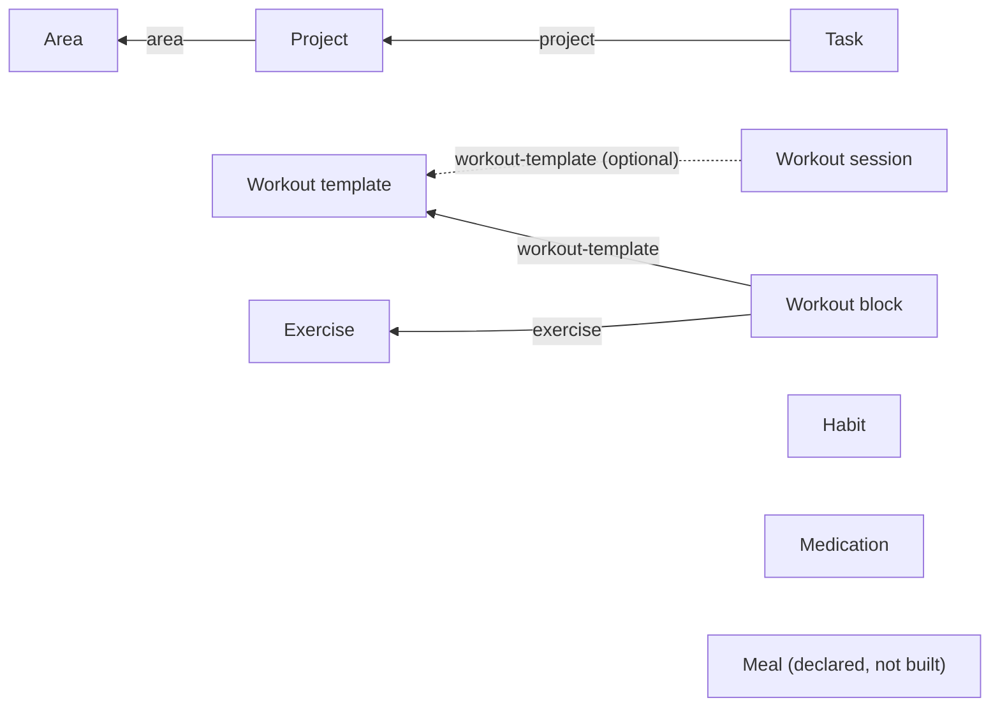

# RKA OS Mobile — Data Schema

One SQLite database (`rka-os.db`), one master table per concept, plus a generic relations table — the Notion-database model: every "add" is a row in `items`, typed by `type`; cross-entity links live in `itemRelations`; every screen (Areas, Projects, Tasks, Medications, Calendar, ...) is a filtered/grouped **view** over these same tables, not its own store.

This file is the source of truth for the schema. Update it whenever `src/db/database.ts`'s `initSchema()` or an entity's `metadata` shape changes. For a live, clickable version of this same schema (with a form to propose new relations), ask Claude to show the interactive entity-schema widget in chat.

> **Naming note:** the `type` discriminator, column names, `relationType` values, and identifiers throughout the codebase (`ItemType`, `getRelation(id, 'area')`, `AreasScreen.tsx`, `getProjectItemCount`, etc.) all use the literal words **`area`** and **`project`** — these are internal/code names and are never renamed. Every *user-facing* string, however, must say **"Domain"** (for `area`) and **"Mission"** (for `project`) instead — this is an established product-vocabulary decision, not a bug. If you're adding a new screen, alert, label, or empty-state copy that surfaces an area/project entity to the user, use "Domain"/"Mission", not "Area"/"Project".

## Relation graph

Each arrow is one `itemRelations` edge, labeled with its `relationType` — read `Task -- project --> Project` as "a task relates to a project via relationType `'project'`". The unconnected nodes (Habit, Medication, Meal) have no relations wired up yet — they're independent rows in `items` today.

## Tables

### `items` — the master table

Every entity type (`area`, `project`, `task`, `habit`, `medication`, `workout-template`, `workout-block`, `exercise`, `workout-session`, `meal`) is a row here, discriminated by `type`.

| Column | Type | Notes |
|---|---|---|
| `id` | TEXT PK | uuid |
| `type` | TEXT | entity type discriminator |
| `title` | TEXT | display name |
| `status` | TEXT | `inbox` \| `active` \| `someday` \| `scheduled` \| `due-today` \| `overdue` \| `completed` \| `skipped` \| `archived` \| `cancelled` |
| `notes` | TEXT? | free-form notes |
| `voice_transcript` | TEXT? | original voice capture, pre-edit |
| `scheduledDate` | TEXT? | `YYYY-MM-DD` |
| `dueDate` | TEXT? | `YYYY-MM-DD` |
| `rrule` | TEXT? | recurrence rule (not yet used by any type in practice) |
| `metadata` | TEXT? | JSON blob, shape is type-specific — see below |
| `createdAt` / `updatedAt` | INTEGER | epoch ms |
| `userId` | TEXT? | reserved for multi-user/sync |
| `archivedAt` / `deletedAt` | INTEGER? | soft-delete/-archive markers |

An item is captured "unclassified" by defaulting to `type='task'`, `status='inbox'` — classification means `processInboxItem()` changing `status` (and, for Project/Area/Habit/Medication destinations, `type` too).

### `itemRelations` — generic single-select relations

The Notion "relation property" equivalent. One row per `(sourceId, relationType)` — each source has at most one target per relation type (single-select, not multi-relation).

| Column | Type | Notes |
|---|---|---|
| `id` | TEXT PK | uuid |
| `sourceId` | TEXT | the item pointing at another (e.g. a task) |
| `targetId` | TEXT | the item being pointed at (e.g. a project) |
| `relationType` | TEXT | e.g. `'project'`, `'area'` |
| `createdAt` | INTEGER | epoch ms |

API (`src/db/database.ts`): `setRelation(sourceId, relationType, targetId \| null)`, `getRelation(sourceId, relationType)`, `getRelatedItems(targetId, relationType)`, `countRelated(targetId, relationType)` — the rollup primitive.

Currently used relations:
- `project -> area` (relationType `'area'`)
- `task -> project` (relationType `'project'`)
- `workout-block -> workout-template` (relationType `'workout-template'`)
- `workout-block -> exercise` (relationType `'exercise'`)
- `workout-session -> workout-template` (relationType `'workout-template'`, optional — only set for template-started sessions)

### `itemInstances`, `activityLogs`, `appSettings`

Supporting tables, not part of the entity/relation model: `itemInstances` tracks per-day scheduling instances of recurring items; `activityLogs` is an audit trail (dose logs, status changes); `appSettings` is a flat key-value store.

## Entity type reference

| Type | Status | Type-specific `metadata` fields |
|---|---|---|
| `area` (user-facing: **Domain**) | built | none yet |
| `project` (user-facing: **Mission**) | built | none yet (area link lives in `itemRelations`, not metadata) |
| `task` | built | `gtdContext` (`today`\|`morning`\|`evening`\|`someday`\|`project`\|`area`\|`habit`\|`medication`\|`reference`), `timeOfDay` (`morning`\|`evening`) |
| `habit` | built | `gtdContext` (set to `'habit'` on triage). Quantified habits additionally store a `HabitMeta` blob in `metadata` (see `src/utils/habitMeta.ts`): `{ intent: 'build'\|'quit', measurement: 'binary'\|'count'\|'duration', targetValue, targetUnit?, targetPeriod: 'daily'\|'weekly'\|'monthly'\|'custom', customPeriodDays?, contextualAction: 'mark-done'\|'add-one'\|'enter-value', potentialStat?, potentialTargetDays? }`. Missing/malformed metadata defaults to binary/daily/mark-done, so every pre-existing habit is unaffected. Manual samples for count/duration habits are `'habit-sample'` `activityLogs` rows (`entityId` = habit id, `details: {value, note?}`); period progress is always recomputed from these events, never a stored running total. Undo removes the most recent sample. |
| `routine` | built | none (routine metadata lives on its steps) |
| `routine-step` | built | `RoutineStepMeta` (see `src/utils/routineMeta.ts`): `{ durationSeconds?, autoAdvance, instructions? }`; step order is the app's shared manual-order table (`itemOrder`, listKey `routine:<routineId>`), not a metadata field |
| `routine-session` | built | `RoutineSessionMeta`: `{ currentStepIndex, stepStartedAt, elapsedBeforePauseMs, status: 'running'\|'paused', stepOverrides? }`. Remaining step time is always derived from these persisted timestamps (`computeStepRemainingSeconds`), never a local counter, so it is correct immediately after backgrounding or a full relaunch. Step transitions are logged as `activityLogs` rows (`'routine-step-completed'`\|`'routine-step-skipped'`). **Never writes to `domainContributions` and never sets `potentialStat`** — only a linked habit's own maintenance math may affect Potential, so finishing a routine never double-counts. |
| `medication` | built | `dose`, `stockRemaining` (derived total, see Packaging below), `initialStock`, `refillThreshold`, `lastTakenAt`, `maxPerDay`, `minHoursBetweenDoses`, `frequency`, `containerLabel`, `containerSize`, `containersPerRestock`, `sheetsPerContainer`, `pillsPerSheet`, `packagingNote`, `containers[]` |
| `workout-template` | built | none yet |
| `workout-block` | built | `sets`, `reps`, `weight`, `restSeconds`, `notes` |
| `exercise` | built | `muscleGroup`, `equipment`, `notes`, `imageKey` |
| `workout-session` | built | none (sets are logged as `activityLogs` rows, `actionType: 'workout-set-logged'`, `entityId` = exercise id, `details`: `{sessionId, setNumber, reps, weight, weightUnit}`) |
| `meal` | declared, not built | — |

## Medication packaging & stock

Stock isn't just one flat pill count — a medication can track real inventory as an array of containers, so "restock" is additive (adds new containers) instead of overwriting the total. Modeled per medication, since packaging varies:

- **Elvanse example**: 1 container of 30 pills per restock (`containerSize: 30`, `containersPerRestock: 1`).
- **Dexamfetamine example**: a restock is 2 boxes of 30 (`containerSize: 30`, `containersPerRestock: 2`), each box further breaking into 3 sheets of 10 (`sheetsPerContainer: 3`, `pillsPerSheet: 10` — descriptive only, sheets aren't tracked as separate stateful units, only containers are).

`containers: { total: number; remaining: number }[]` holds the real inventory instances. Taking a dose decrements the first non-empty container (oldest/open one first, via `decrementStock()`); restocking (`restockMedication(itemId, count?)`) appends `count` new full containers. `getTotalStock(meta)` sums `containers[].remaining` (or falls back to the legacy flat `stockRemaining` for medications that never configured packaging).

Display is projected against the *configured* full-restock shape, not just whatever containers happen to exist yet — `getStockBreakdown(meta)` pads out to `containersPerRestock` slots (so an empty, never-restocked medication still shows a `0/30` slot instead of nothing) and, when `sheetsPerContainer`/`pillsPerSheet` are set, derives a sheet-level view assuming pills are consumed front-to-back (the in-use sheet drains first; later sheets stay full until reached). `getContainerSummary(meta)` renders this as a compact string, e.g. for Dexamfetamine after 7 doses taken: `23/60 · 23/30 (3/10+10/10+10/10) + 0/30 (0/10+0/10+0/10)`.

`packagingNote` is a free-text escape hatch for one-off quirks that don't fit the container model cleanly (e.g. "28 in main pack + 2 topper blister").

## Known gaps

- No cross-device sync — everything above is local-only SQLite (`backgroundSync.ts` is still a stub).
- No cascade delete on `itemRelations` when an item is soft-deleted — orphaned relation rows are harmless (rollup queries filter deleted items) but accumulate.
- Relations are single-select only; a multi-relation (e.g. a task in two projects) would need dropping the `UNIQUE(sourceId, relationType)` constraint.
- No per-day medication dose-schedule model (so medication history can only show two states: taken / not taken, not a third "not scheduled" state).
