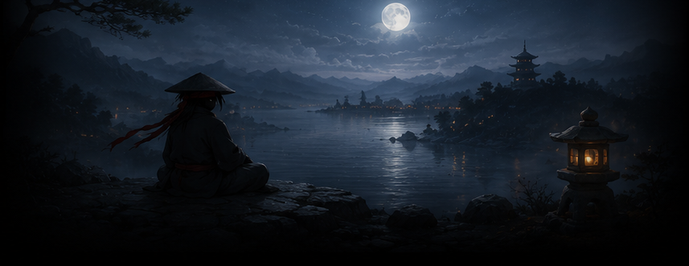
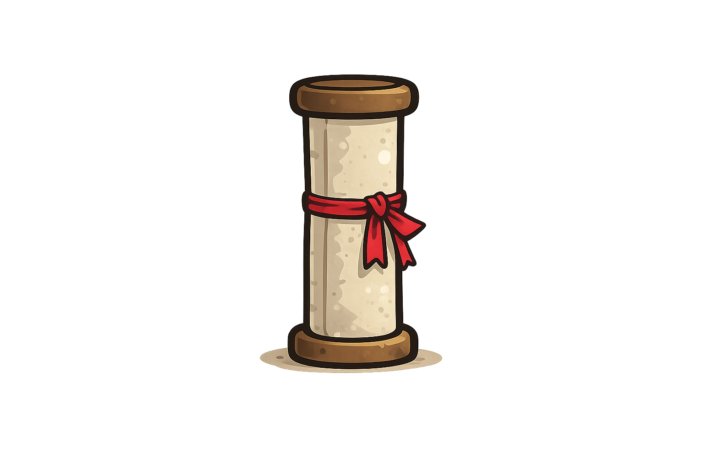
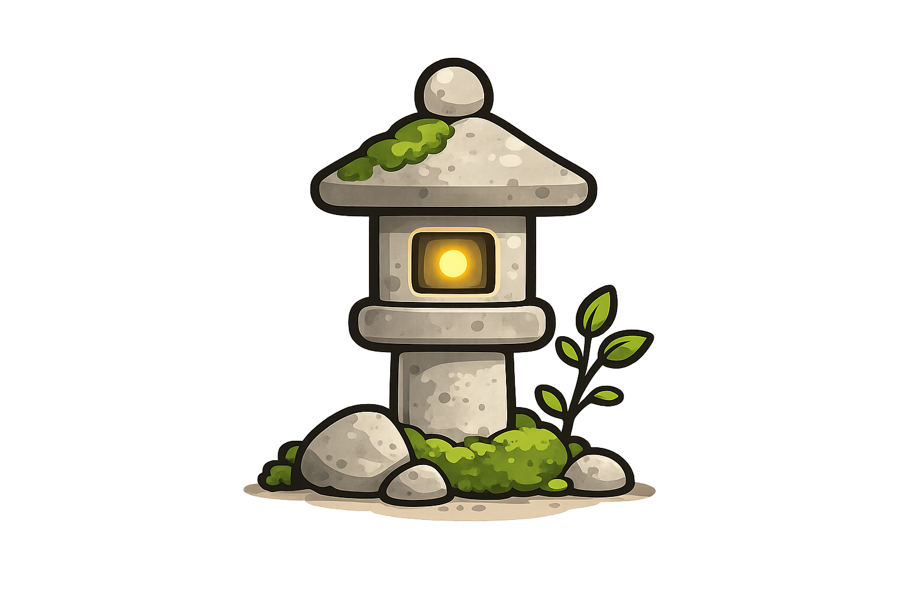
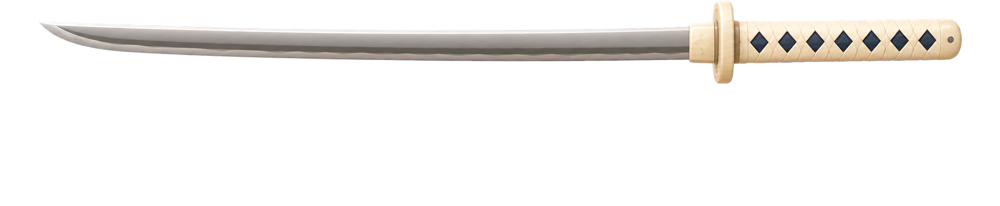

# RKA.OS — Visual Tour

A short, visual walkthrough of what RKA.OS looks like today. This is a tour, not a spec — every claim here links back to [`../reference/`](../reference/) for the actual current-state detail. If something here looks out of date, trust the reference docs and `DESIGN_CHECKLIST.md`, and fix this page to match.

_Screenshots below reference existing asset files directly rather than duplicating image binaries into this folder — see `assets/` for where to add real device screenshots as they're captured._

## The feel: Things 3 interactions, Moonly-inspired look

Fast, flat, minimal capture and list interactions (Things 3), rendered in a deep, richly-colored visual language with Japanese/Ronin illustration motifs instead of Moonly's lunar ones. Full interaction spec: [`../../../apps/mobile/THINGS_3_DESIGN.md`](../../../apps/mobile/THINGS_3_DESIGN.md). Full visual spec: [`../reference/components.md`](../reference/components.md), [`../reference/tokens.md`](../reference/tokens.md).

## Home hero — time-of-day + mood

The greeting card's background shifts with time of day (dawn/day/ember/night gradients); mood shows up only as a small corner accent, never a full hue swap. Detail: [`../reference/components.md`](../reference/components.md#hero-card-color-system--roningreetingcardtsx).

## Commissioned illustrations

Chibi-Ronin-style flat vector illustrations, used for the Inbox card and Next Up's empty state respectively. Style rule and full inventory: [`../reference/iconography.md`](../reference/iconography.md).

## Companion progress

A katana-silhouette progress bar reflects real today's-progress data (not a placeholder — see [`../reference/decision-log.md`](../reference/decision-log.md)).

## Ronin 3D companion

A real, mood-driven 3D character exists (`RoninCharacter.tsx`), currently only visualized in Profile's dev bench while the model continues improving — not yet part of the main Home experience. See `apps/mobile/CLAUDE.md`'s "Ronin 3D Companion" section for status.

## What's not pictured yet

Most non-Home screens (Areas, Projects, Medications, Calendar, Menu) haven't been visually restyled yet and aren't pictured here — check `DESIGN_CHECKLIST.md`'s per-screen checklist for current status before assuming a screen matches this visual language.
