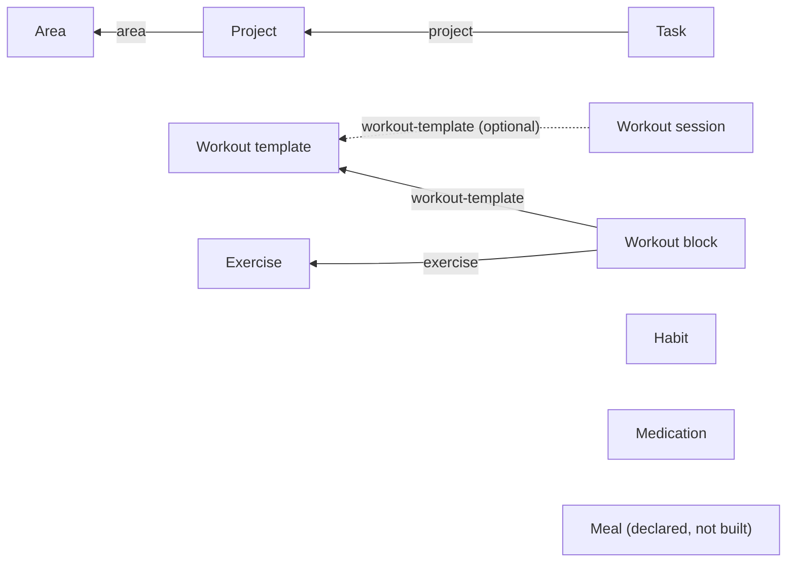

# Workout Set Logging (Sets/Reps/Progressive Overload) Implementation Plan

> **For agentic workers:** REQUIRED SUB-SKILL: Use superpowers:subagent-driven-development (recommended) or superpowers:executing-plans to implement this plan task-by-task. Steps use checkbox (`- [ ]`) syntax for tracking.

**Goal:** Let a user start a workout (from a template or freeform), log actual sets/reps/weight per exercise against a real `workout-session` entity, and see their last performance for each exercise while logging — closing the gap SCHEMA.md flags ("No workout-session model").

**Architecture:** Reuse the existing generic `items`/`activityLogs` tables — no new SQLite tables. A workout session is a new `workout-session` item (`type` discriminator, status `active`→`completed`), optionally related to a `workout-template` via the existing `itemRelations` mechanism. Each logged set is an `activityLogs` row (`actionType: 'workout-set-logged'`, `entityId` = the exercise's item id so "what did I do last time for Bench Press" is a direct indexed lookup, `details` = JSON `{sessionId, setNumber, reps, weight, weightUnit}`). Grouping/formatting logic is pure and unit-tested (`src/utils/workoutSet.ts`); the SQLite-touching wrappers in `src/db/database.ts` follow the existing convention of not being unit-tested directly (verified by running the app, same as every other `database.ts` function).

**Tech Stack:** React Native + Expo (existing app), expo-sqlite, `node:test` for pure-logic unit tests (`node --experimental-strip-types --test`), React Navigation native-stack.

## Global Constraints

- No new SQLite tables — model everything through `items` + `itemRelations` + `activityLogs`, per the existing Notion-style schema (`apps/mobile/SCHEMA.md`).
- Weight is always in kg for v1 (no unit picker) — nothing in the codebase currently supports lbs, don't add unit-conversion scope.
- No progressive-overload *suggestions* in v1 — only surfacing last performance as reference text while logging (per product decision). Don't build a recommendation/target-bump algorithm.
- No edit/delete of individual logged sets in v1 — a session is append-only while active; keep scope to capture only.
- Follow `apps/mobile/CLAUDE.md`: RN primitives + `StyleSheet`, theme via `useThemeContext()` + `getThemeColors(isDark)`, Things-3-flat visual patterns (flat rows/cards, hairline separators, no shadows).
- Update `apps/mobile/SCHEMA.md` and `apps/mobile/CLAUDE.md` in the same task that makes them true (multi-agent protocol in `AGENTS.md`).
- Test command: `npm test` (root `apps/mobile/package.json` → `node --disable-warning=MODULE_TYPELESS_PACKAGE_JSON --experimental-strip-types --test src/**/*.test.ts`), run from `apps/mobile/`.

---

### Task 1: Pure set-log domain logic (`workoutSet.ts`)

**Files:**
- Create: `apps/mobile/src/utils/workoutSet.ts`
- Test: `apps/mobile/src/utils/workoutSet.test.ts`

**Interfaces:**
- Produces: `WorkoutSetDetails` interface (`{ sessionId: string; setNumber: number; reps: number; weight: number; weightUnit: string }`), `parseSetLogDetails(details?: string | null): WorkoutSetDetails | null`, `formatSetSummary(set: WorkoutSetDetails): string`, `getMostRecentSessionSets(logs: Array<{ timestamp: number; details?: string | null }>, excludeSessionId?: string): WorkoutSetDetails[]` — all consumed by Task 2 (`database.ts`) and Task 4 (`WorkoutSessionScreen.tsx`).

- [ ] **Step 1: Write the failing tests**

```typescript
// apps/mobile/src/utils/workoutSet.test.ts
// @ts-nocheck -- executed directly by Node's TypeScript test runner; the Expo app intentionally omits Node ambient types.
import { test } from 'node:test';
import assert from 'node:assert/strict';
import { parseSetLogDetails, formatSetSummary, getMostRecentSessionSets } from './workoutSet.ts';

test('parseSetLogDetails returns null for missing/malformed/incomplete details', () => {
  assert.equal(parseSetLogDetails(undefined), null);
  assert.equal(parseSetLogDetails(null), null);
  assert.equal(parseSetLogDetails('not json'), null);
  assert.equal(parseSetLogDetails(JSON.stringify({ sessionId: 's1', setNumber: 1 })), null);
});

test('parseSetLogDetails reads valid fields and defaults weightUnit to kg', () => {
  assert.deepEqual(
    parseSetLogDetails(JSON.stringify({ sessionId: 's1', setNumber: 2, reps: 8, weight: 60 })),
    { sessionId: 's1', setNumber: 2, reps: 8, weight: 60, weightUnit: 'kg' },
  );
  assert.deepEqual(
    parseSetLogDetails(JSON.stringify({ sessionId: 's1', setNumber: 1, reps: 5, weight: 100, weightUnit: 'lbs' })),
    { sessionId: 's1', setNumber: 1, reps: 5, weight: 100, weightUnit: 'lbs' },
  );
});

test('formatSetSummary combines reps and weight', () => {
  assert.equal(
    formatSetSummary({ sessionId: 's1', setNumber: 1, reps: 8, weight: 60, weightUnit: 'kg' }),
    '8 × 60kg',
  );
});

test('getMostRecentSessionSets returns only the latest session, sorted by set number', () => {
  const log = (sessionId, setNumber, reps, weight, timestamp) => ({
    timestamp,
    details: JSON.stringify({ sessionId, setNumber, reps, weight, weightUnit: 'kg' }),
  });
  const logs = [
    log('old-session', 1, 8, 55, 100),
    log('old-session', 2, 8, 55, 110),
    log('new-session', 2, 6, 62.5, 300),
    log('new-session', 1, 8, 60, 290),
  ];
  assert.deepEqual(
    getMostRecentSessionSets(logs).map((s) => `${s.setNumber}:${s.reps}x${s.weight}`),
    ['1:8x60', '2:6x62.5'],
  );
});

test('getMostRecentSessionSets excludes the given session id (the in-progress one)', () => {
  const log = (sessionId, setNumber, timestamp) => ({
    timestamp,
    details: JSON.stringify({ sessionId, setNumber, reps: 8, weight: 60, weightUnit: 'kg' }),
  });
  const logs = [log('current', 1, 400), log('previous', 1, 100)];
  assert.deepEqual(
    getMostRecentSessionSets(logs, 'current').map((s) => s.sessionId),
    ['previous'],
  );
});

test('getMostRecentSessionSets returns empty array when there is no history', () => {
  assert.deepEqual(getMostRecentSessionSets([]), []);
});

test('getMostRecentSessionSets skips unparseable log rows', () => {
  const logs = [{ timestamp: 1, details: 'garbage' }];
  assert.deepEqual(getMostRecentSessionSets(logs), []);
});
```

- [ ] **Step 2: Run tests to verify they fail**

Run (from `apps/mobile/`): `npm test -- --test-name-pattern="parseSetLogDetails|formatSetSummary|getMostRecentSessionSets"`
Expected: FAIL — `Cannot find module './workoutSet.ts'`

- [ ] **Step 3: Write the implementation**

```typescript
// apps/mobile/src/utils/workoutSet.ts
export interface WorkoutSetDetails {
  sessionId: string;
  setNumber: number;
  reps: number;
  weight: number;
  weightUnit: string;
}

export function parseSetLogDetails(details?: string | null): WorkoutSetDetails | null {
  if (!details) return null;
  try {
    const parsed = JSON.parse(details);
    if (typeof parsed.sessionId !== 'string') return null;
    if (typeof parsed.setNumber !== 'number') return null;
    if (typeof parsed.reps !== 'number') return null;
    if (typeof parsed.weight !== 'number') return null;
    return {
      sessionId: parsed.sessionId,
      setNumber: parsed.setNumber,
      reps: parsed.reps,
      weight: parsed.weight,
      weightUnit: typeof parsed.weightUnit === 'string' ? parsed.weightUnit : 'kg',
    };
  } catch {
    return null;
  }
}

export function formatSetSummary(set: WorkoutSetDetails): string {
  return `${set.reps} × ${set.weight}${set.weightUnit}`;
}

// Given raw activityLogs rows for one exercise (any mix of sessions, any order),
// return just the sets from the single most recent session — this is the "last
// time" reference shown while logging. excludeSessionId drops the in-progress
// session so a session never shows itself back as its own "last time".
export function getMostRecentSessionSets(
  logs: Array<{ timestamp: number; details?: string | null }>,
  excludeSessionId?: string
): WorkoutSetDetails[] {
  const sorted = [...logs].sort((a, b) => b.timestamp - a.timestamp);
  let latestSessionId: string | null = null;
  const setsInLatestSession: WorkoutSetDetails[] = [];

  for (const log of sorted) {
    const parsed = parseSetLogDetails(log.details);
    if (!parsed) continue;
    if (excludeSessionId && parsed.sessionId === excludeSessionId) continue;
    if (latestSessionId === null) latestSessionId = parsed.sessionId;
    if (parsed.sessionId !== latestSessionId) continue;
    setsInLatestSession.push(parsed);
  }

  return setsInLatestSession.sort((a, b) => a.setNumber - b.setNumber);
}
```

- [ ] **Step 4: Run tests to verify they pass**

Run (from `apps/mobile/`): `npm test`
Expected: PASS — all `workoutSet.test.ts` cases green, no regressions in the rest of the suite.

- [ ] **Step 5: Commit**

```bash
git add apps/mobile/src/utils/workoutSet.ts apps/mobile/src/utils/workoutSet.test.ts
git commit -m "feat(mobile): add pure workout-set-log parsing/grouping logic"
```

---

### Task 2: DB layer — `workout-session` entity + set logging

**Files:**
- Modify: `apps/mobile/src/db/types.ts:1`
- Modify: `apps/mobile/src/db/database.ts` (add new exports near the end, after `getTodayLogs`)
- Modify: `apps/mobile/SCHEMA.md`

**Interfaces:**
- Consumes: `WorkoutSetDetails`, `getMostRecentSessionSets` from `../utils/workoutSet` (Task 1); `createItem`, `setRelation`, `logActivity`, `updateItemStatus`, `getDb`, `formatDate`, `getItemWithMetadata` (all already exist in `database.ts`).
- Produces: `startWorkoutSession(templateId?: string | null): string`, `LogWorkoutSetInput` interface, `logWorkoutSet(input: LogWorkoutSetInput): string`, `finishWorkoutSession(sessionId: string): void`, `getLastSessionSetsForExercise(exerciseId: string, excludeSessionId?: string): WorkoutSetDetails[]` — all consumed by Task 4 (`WorkoutSessionScreen.tsx`) and Task 6 (`ExerciseDetailScreen.tsx`).

- [ ] **Step 1: Add the `workout-session` type discriminator**

In `apps/mobile/src/db/types.ts:1`, change:

```typescript
export type ItemType = 'area' | 'project' | 'task' | 'habit' | 'medication' | 'workout-template' | 'workout-block' | 'exercise' | 'meal' | 'object';
```

to:

```typescript
export type ItemType = 'area' | 'project' | 'task' | 'habit' | 'medication' | 'workout-template' | 'workout-block' | 'exercise' | 'workout-session' | 'meal' | 'object';
```

- [ ] **Step 2: Add the DB functions**

Append to `apps/mobile/src/db/database.ts`, after the `getTodayLogs` function (end of file):

```typescript
import type { WorkoutSetDetails } from '../utils/workoutSet';
import { getMostRecentSessionSets } from '../utils/workoutSet';

// A logged workout occurrence. Optionally related to a workout-template
// (relationType 'workout-template') when started from one; freeform sessions
// have no such relation row. Status flows 'active' -> 'completed'.
export function startWorkoutSession(templateId?: string | null): string {
  const title = templateId ? (getItemWithMetadata(templateId)?.title ?? 'Workout') : 'Freeform Workout';
  const sessionId = createItem('workout-session', title, 'active', formatDate(new Date()));
  if (templateId) setRelation(sessionId, 'workout-template', templateId);
  return sessionId;
}

export interface LogWorkoutSetInput {
  sessionId: string;
  exerciseId: string;
  setNumber: number;
  reps: number;
  weight: number;
  weightUnit?: string;
}

// entityId = exerciseId (not sessionId) so "what did I do last time for this
// exercise" is a direct, single-column lookup across every session ever logged.
export function logWorkoutSet(input: LogWorkoutSetInput): string {
  return logActivity(
    input.exerciseId,
    'workout-set-logged',
    JSON.stringify({
      sessionId: input.sessionId,
      setNumber: input.setNumber,
      reps: input.reps,
      weight: input.weight,
      weightUnit: input.weightUnit ?? 'kg',
    })
  );
}

export function finishWorkoutSession(sessionId: string): void {
  updateItemStatus(sessionId, 'completed');
}

export function getLastSessionSetsForExercise(exerciseId: string, excludeSessionId?: string): WorkoutSetDetails[] {
  const logs = getDb().getAllSync<ActivityLog>(
    `SELECT * FROM activityLogs WHERE entityId = ? AND actionType = 'workout-set-logged' ORDER BY timestamp DESC LIMIT 200`,
    [exerciseId]
  );
  return getMostRecentSessionSets(logs, excludeSessionId);
}
```

Move the two new top-of-file-style imports (`import type { WorkoutSetDetails }...` and `import { getMostRecentSessionSets }...`) up to the existing import block at the top of the file instead (alongside the other `../utils/*` imports at `apps/mobile/src/db/database.ts:5-8`) — do not leave `import` statements mid-file; only the function bodies go at the end.

- [ ] **Step 3: Update `SCHEMA.md`**

In `apps/mobile/SCHEMA.md`, make these edits:

1. Mermaid diagram (line 12-20) — add the new node and edge:



2. "Currently used relations" list (line 62-66) — add a line: `- `workout-session -> workout-template` (relationType `'workout-template'`, optional — only set for template-started sessions)`

3. Entity type reference table (line 74-84) — add a row after `exercise`:

```
| `workout-session` | built | none (sets are logged as `activityLogs` rows, `actionType: 'workout-set-logged'`, `entityId` = exercise id, `details`: `{sessionId, setNumber, reps, weight, weightUnit}`) |
```

4. `items` table row for `type` (line 28) — update the type list to include `workout-session`:

```
Every entity type (`area`, `project`, `task`, `habit`, `medication`, `workout-template`, `workout-block`, `exercise`, `workout-session`, `meal`) is a row here, discriminated by `type`.
```

5. "Known gaps" (line 99-105) — delete the line `- No workout-session model (so "start workout" / "continue workout" have no data to attach to yet).`

- [ ] **Step 4: Typecheck**

Run (from `apps/mobile/`): `npx tsc --noEmit`
Expected: no new errors.

- [ ] **Step 5: Commit**

```bash
git add apps/mobile/src/db/types.ts apps/mobile/src/db/database.ts apps/mobile/SCHEMA.md
git commit -m "feat(mobile): add workout-session entity and set-logging DB functions"
```

---

### Task 3: `SetLogRow` — one-set capture component

**Files:**
- Create: `apps/mobile/src/components/SetLogRow.tsx`

**Interfaces:**
- Produces: `SetLogRow` component with props `{ setNumber: number; initialReps?: string; initialWeight?: string; onLog: (reps: number, weight: number) => void }` — consumed by Task 4 (`WorkoutSessionScreen.tsx`).

- [ ] **Step 1: Write the component**

```tsx
// apps/mobile/src/components/SetLogRow.tsx
import { useState } from 'react';
import { StyleSheet, Text, TextInput, TouchableOpacity, View } from 'react-native';
import * as Haptics from 'expo-haptics';
import { useThemeContext } from '../hooks/useThemeContext';
import { getThemeColors } from '../theme';

interface SetLogRowProps {
  setNumber: number;
  initialReps?: string;
  initialWeight?: string;
  onLog: (reps: number, weight: number) => void;
}

export function SetLogRow({ setNumber, initialReps, initialWeight, onLog }: SetLogRowProps) {
  const { isDark } = useThemeContext();
  const palette = getThemeColors(isDark);
  const [reps, setReps] = useState(initialReps ?? '');
  const [weight, setWeight] = useState(initialWeight ?? '');

  const repsNum = Number(reps);
  const weightNum = Number(weight);
  const canLog = reps.trim() !== '' && weight.trim() !== '' && Number.isFinite(repsNum) && repsNum > 0 && Number.isFinite(weightNum) && weightNum >= 0;

  const handleLog = () => {
    if (!canLog) return;
    Haptics.notificationAsync(Haptics.NotificationFeedbackType.Success);
    onLog(repsNum, weightNum);
    setReps('');
    setWeight('');
  };

  return (
    <View style={styles.row}>
      <Text style={[styles.setNumber, { color: palette.textTertiary }]}>{setNumber}</Text>
      <TextInput
        style={[styles.input, { color: palette.text, borderColor: palette.separator }]}
        placeholder="Reps"
        placeholderTextColor={palette.textTertiary}
        value={reps}
        onChangeText={setReps}
        keyboardType="number-pad"
        keyboardAppearance={isDark ? 'dark' : 'light'}
      />
      <TextInput
        style={[styles.input, { color: palette.text, borderColor: palette.separator }]}
        placeholder="kg"
        placeholderTextColor={palette.textTertiary}
        value={weight}
        onChangeText={setWeight}
        keyboardType="decimal-pad"
        keyboardAppearance={isDark ? 'dark' : 'light'}
      />
      <TouchableOpacity
        style={[styles.logButton, { backgroundColor: canLog ? palette.deeperBlue : palette.fill }]}
        onPress={handleLog}
        disabled={!canLog}
        hitSlop={8}
      >
        <Text style={[styles.logButtonText, { color: canLog ? '#ffffff' : palette.textTertiary }]}>Log</Text>
      </TouchableOpacity>
    </View>
  );
}

const styles = StyleSheet.create({
  row: { flexDirection: 'row', alignItems: 'center', gap: 8 },
  setNumber: { width: 20, fontSize: 13, fontWeight: '600', textAlign: 'center' },
  input: { flex: 1, borderWidth: StyleSheet.hairlineWidth, borderRadius: 10, fontSize: 15, paddingVertical: 8, paddingHorizontal: 10 },
  logButton: { borderRadius: 10, paddingVertical: 8, paddingHorizontal: 16, justifyContent: 'center' },
  logButtonText: { fontSize: 14, fontWeight: '700', fontFamily: 'Inter_700Bold' },
});
```

- [ ] **Step 2: Typecheck**

Run (from `apps/mobile/`): `npx tsc --noEmit`
Expected: no new errors.

- [ ] **Step 3: Commit**

```bash
git add apps/mobile/src/components/SetLogRow.tsx
git commit -m "feat(mobile): add SetLogRow set-capture component"
```

---

### Task 4: `WorkoutSessionScreen` — the live logging screen

**Files:**
- Create: `apps/mobile/src/screens/WorkoutSessionScreen.tsx`

**Interfaces:**
- Consumes: `startWorkoutSession`, `logWorkoutSet`, `finishWorkoutSession`, `getLastSessionSetsForExercise`, `applyManualOrder`, `getRelatedItems`, `getRelation`, `getItemWithMetadata` (Task 2 + existing `database.ts`); `formatSetSummary`, `WorkoutSetDetails` (Task 1); `SetLogRow` (Task 3); `parseBlockMeta`, `formatBlockSummary` (existing `utils/workoutBlock.ts`); `parseExerciseMeta` (existing `utils/exerciseLibrary.ts`); `ExercisePickerSheet`, `ExerciseThumbnail`, `LensSurface` (existing components).
- Produces: `WorkoutSessionScreen` component, route params `{ templateId?: string }` — consumed by Task 5 (navigation wiring).

- [ ] **Step 1: Write the screen**

```tsx
// apps/mobile/src/screens/WorkoutSessionScreen.tsx
import { useCallback, useState } from 'react';
import { Alert, ScrollView, StyleSheet, Text, TouchableOpacity, View } from 'react-native';
import { useNavigation, useRoute } from '@react-navigation/native';
import * as Haptics from 'expo-haptics';
import {
  applyManualOrder,
  finishWorkoutSession,
  getItemWithMetadata,
  getLastSessionSetsForExercise,
  getRelatedItems,
  getRelation,
  logWorkoutSet,
  startWorkoutSession,
} from '../db/database';
import { useThemeContext } from '../hooks/useThemeContext';
import { getThemeColors } from '../theme';
import { LensSurface } from '../components/LensSurface';
import { ExercisePickerSheet } from '../components/ExercisePickerSheet';
import { ExerciseThumbnail } from '../components/ExerciseThumbnail';
import { SetLogRow } from '../components/SetLogRow';
import { parseBlockMeta, formatBlockSummary } from '../utils/workoutBlock';
import { parseExerciseMeta } from '../utils/exerciseLibrary';
import { formatSetSummary, type WorkoutSetDetails } from '../utils/workoutSet';
import { Plus } from '../icons';
import type { Item } from '../db/types';

interface WorkoutSessionRouteParams {
  templateId?: string;
}

interface SessionExerciseRow {
  exerciseId: string;
  exerciseTitle: string;
  exerciseImageKey?: string;
  targetSummary?: string;
  loggedSets: WorkoutSetDetails[];
  lastSessionSets: WorkoutSetDetails[];
}

function buildRowFromExercise(exercise: Item, sessionId: string, targetSummary?: string): SessionExerciseRow {
  return {
    exerciseId: exercise.id,
    exerciseTitle: exercise.title,
    exerciseImageKey: parseExerciseMeta(exercise.metadata).imageKey,
    targetSummary,
    loggedSets: [],
    lastSessionSets: getLastSessionSetsForExercise(exercise.id, sessionId),
  };
}

function buildRowsFromTemplate(templateId: string, sessionId: string): SessionExerciseRow[] {
  const blocks = applyManualOrder(`workout-template:${templateId}`, getRelatedItems(templateId, 'workout-template'));
  const rows: SessionExerciseRow[] = [];
  for (const block of blocks) {
    const exerciseId = getRelation(block.id, 'exercise');
    const exercise = exerciseId ? getItemWithMetadata(exerciseId) : null;
    if (!exercise) continue;
    rows.push(buildRowFromExercise(exercise, sessionId, formatBlockSummary(parseBlockMeta(block.metadata))));
  }
  return rows;
}

export function WorkoutSessionScreen() {
  const navigation = useNavigation();
  const route = useRoute();
  const { templateId } = (route.params as WorkoutSessionRouteParams) ?? {};
  const { isDark } = useThemeContext();
  const palette = getThemeColors(isDark);

  const [sessionId] = useState(() => startWorkoutSession(templateId ?? null));
  const [rows, setRows] = useState<SessionExerciseRow[]>(() => (templateId ? buildRowsFromTemplate(templateId, sessionId) : []));
  const [pickerOpen, setPickerOpen] = useState(false);

  const handlePickExercise = (exercise: Item) => {
    setPickerOpen(false);
    setRows((prev) => (prev.some((row) => row.exerciseId === exercise.id) ? prev : [...prev, buildRowFromExercise(exercise, sessionId)]));
  };

  const handleLogSet = (exerciseId: string, reps: number, weight: number) => {
    setRows((prev) =>
      prev.map((row) => {
        if (row.exerciseId !== exerciseId) return row;
        const setNumber = row.loggedSets.length + 1;
        logWorkoutSet({ sessionId, exerciseId, setNumber, reps, weight });
        const newSet: WorkoutSetDetails = { sessionId, exerciseId, setNumber, reps, weight, weightUnit: 'kg' } as WorkoutSetDetails & { exerciseId: string };
        return { ...row, loggedSets: [...row.loggedSets, newSet] };
      })
    );
  };

  const handleFinish = useCallback(() => {
    const totalSets = rows.reduce((sum, row) => sum + row.loggedSets.length, 0);
    if (totalSets === 0) {
      Alert.alert('No sets logged', 'Log at least one set before finishing, or go back to discard this workout.');
      return;
    }
    finishWorkoutSession(sessionId);
    Haptics.notificationAsync(Haptics.NotificationFeedbackType.Success);
    navigation.goBack();
  }, [rows, sessionId, navigation]);

  return (
    <LensSurface
      title="Log Workout"
      headerRight={
        <TouchableOpacity onPress={handleFinish} hitSlop={12}>
          <Text style={[styles.finishText, { color: palette.deeperBlue }]}>Finish</Text>
        </TouchableOpacity>
      }
    >
      <ScrollView contentContainerStyle={styles.content} showsVerticalScrollIndicator={false}>
        {rows.length === 0 && (
          <View style={styles.empty}>
            <Text style={[styles.emptyTitle, { color: palette.text }]}>No exercises yet</Text>
            <Text style={[styles.emptySub, { color: palette.textSecondary }]}>Tap "Add exercise" below to get started.</Text>
          </View>
        )}

        {rows.map((row) => (
          <View key={row.exerciseId} style={[styles.card, { backgroundColor: palette.surface, borderColor: palette.separator }]}>
            <View style={styles.cardHeader}>
              <ExerciseThumbnail imageKey={row.exerciseImageKey} size={36} />
              <View style={styles.cardHeaderText}>
                <Text style={[styles.cardTitle, { color: palette.text }]} numberOfLines={1}>{row.exerciseTitle}</Text>
                {row.targetSummary && (
                  <Text style={[styles.cardTarget, { color: palette.textTertiary }]} numberOfLines={1}>{row.targetSummary}</Text>
                )}
              </View>
            </View>

            {row.lastSessionSets.length > 0 && (
              <Text style={[styles.lastTime, { color: palette.textTertiary }]} numberOfLines={1}>
                Last time: {row.lastSessionSets.map(formatSetSummary).join(', ')}
              </Text>
            )}

            {row.loggedSets.map((set) => (
              <Text key={set.setNumber} style={[styles.loggedSet, { color: palette.textSecondary }]}>
                Set {set.setNumber} · {formatSetSummary(set)}
              </Text>
            ))}

            <SetLogRow
              setNumber={row.loggedSets.length + 1}
              initialReps={row.lastSessionSets[row.loggedSets.length] ? String(row.lastSessionSets[row.loggedSets.length].reps) : undefined}
              initialWeight={row.lastSessionSets[row.loggedSets.length] ? String(row.lastSessionSets[row.loggedSets.length].weight) : undefined}
              onLog={(reps, weight) => handleLogSet(row.exerciseId, reps, weight)}
            />
          </View>
        ))}

        <TouchableOpacity style={[styles.addRow, { borderColor: palette.separator }]} onPress={() => setPickerOpen(true)} activeOpacity={0.7}>
          <Plus size={18} color={palette.text} strokeWidth={2} />
          <Text style={[styles.addRowText, { color: palette.text }]}>Add exercise</Text>
        </TouchableOpacity>
      </ScrollView>

      <ExercisePickerSheet visible={pickerOpen} onClose={() => setPickerOpen(false)} onPick={handlePickExercise} />
    </LensSurface>
  );
}

const styles = StyleSheet.create({
  content: { paddingHorizontal: 16, paddingBottom: 40, gap: 12 },
  finishText: { fontSize: 16, fontWeight: '700', fontFamily: 'Inter_700Bold' },
  empty: { alignItems: 'center', justifyContent: 'center', gap: 8, paddingTop: 80 },
  emptyTitle: { fontSize: 18, fontWeight: '700', fontFamily: 'Inter_700Bold' },
  emptySub: { fontSize: 14, fontWeight: '400', textAlign: 'center' },
  card: { borderRadius: 14, borderWidth: StyleSheet.hairlineWidth, padding: 12, gap: 8 },
  cardHeader: { flexDirection: 'row', alignItems: 'center', gap: 8 },
  cardHeaderText: { flex: 1, gap: 2 },
  cardTitle: { fontSize: 15, fontWeight: '600', fontFamily: 'Inter_600SemiBold' },
  cardTarget: { fontSize: 12, fontWeight: '500' },
  lastTime: { fontSize: 12, fontWeight: '500' },
  loggedSet: { fontSize: 13, fontWeight: '500' },
  addRow: { flexDirection: 'row', alignItems: 'center', justifyContent: 'center', gap: 6, borderRadius: 14, borderWidth: StyleSheet.hairlineWidth, borderStyle: 'dashed', paddingVertical: 14 },
  addRowText: { fontSize: 14, fontWeight: '600', fontFamily: 'Inter_600SemiBold' },
});
```

Note: `WorkoutSetDetails` (from Task 1) has no `exerciseId` field — it's keyed by the exercise via `entityId` in the DB layer, not inside the JSON payload itself. `handleLogSet` above constructs an object that also carries `exerciseId` for local list-rendering convenience; since `WorkoutSetDetails` doesn't declare that field, either (a) widen the local `loggedSets`/`lastSessionSets` array element type in this file to `WorkoutSetDetails & { exerciseId?: string }`, or (b) simplest: drop the inline `exerciseId` from the constructed object and just key off `row.exerciseId` from the parent closure when rendering (`row.loggedSets` never needs its own `exerciseId` since it's always read alongside `row`). Use (b) — remove `exerciseId` from `newSet` entirely so it's a plain `WorkoutSetDetails`, and delete the `as WorkoutSetDetails & { exerciseId: string }` cast:

```typescript
const newSet: WorkoutSetDetails = { sessionId, setNumber, reps, weight, weightUnit: 'kg' };
```

- [ ] **Step 2: Typecheck**

Run (from `apps/mobile/`): `npx tsc --noEmit`
Expected: no new errors.

- [ ] **Step 3: Commit**

```bash
git add apps/mobile/src/screens/WorkoutSessionScreen.tsx
git commit -m "feat(mobile): add WorkoutSessionScreen for live set logging"
```

---

### Task 5: Wire entry points (navigation, Workouts list, template detail)

**Files:**
- Modify: `apps/mobile/src/navigation/MenuStack.tsx`
- Modify: `apps/mobile/src/screens/WorkoutsScreen.tsx`
- Modify: `apps/mobile/src/screens/WorkoutTemplateDetailScreen.tsx`
- Modify: `apps/mobile/CLAUDE.md`

**Interfaces:**
- Consumes: `WorkoutSessionScreen` (Task 4).

- [ ] **Step 1: Register the route**

In `apps/mobile/src/navigation/MenuStack.tsx`, add the import (after line 12's `WorkoutTemplateDetailScreen` import):

```typescript
import { WorkoutSessionScreen } from '../screens/WorkoutSessionScreen';
```

and add the screen (after line 37's `WorkoutTemplateDetail` entry):

```typescript
      <Stack.Screen name="WorkoutSession" component={WorkoutSessionScreen} />
```

- [ ] **Step 2: Wire "Start empty workout" and add a "Start Workout" long-press action**

In `apps/mobile/src/screens/WorkoutsScreen.tsx`, replace `handleStartEmpty` (lines 51-54):

```typescript
  const handleStartEmpty = () => {
    Alert.alert('Coming soon', 'Live workout tracking is not wired up yet.');
  };
```

with:

```typescript
  const handleStartEmpty = () => {
    (navigation as any).navigate('WorkoutSession', {});
  };
```

and add a "Start Workout" option to `handleLongPress`'s action list (lines 56-79), inserting it before `Rename`:

```typescript
  const handleLongPress = (item: Item) => {
    Haptics.impactAsync(Haptics.ImpactFeedbackStyle.Heavy);
    Alert.alert(item.title, undefined, [
      { text: 'Cancel', style: 'cancel' },
      { text: 'Start Workout', onPress: () => (navigation as any).navigate('WorkoutSession', { templateId: item.id }) },
      { text: 'Rename', onPress: () => openEdit(item) },
      {
        text: 'Delete',
        style: 'destructive',
        onPress: () => {
          Alert.alert(`Delete ${item.title}?`, 'This cannot be undone.', [
            { text: 'Cancel', style: 'cancel' },
            {
              text: 'Delete',
              style: 'destructive',
              onPress: () => {
                deleteItem(item.id);
                refresh();
              },
            },
          ]);
        },
      },
    ]);
  };
```

The `Alert` import at the top of the file (line 2) is already present — no import changes needed here.

- [ ] **Step 3: Add a "Start Workout" header action to the template detail screen**

In `apps/mobile/src/screens/WorkoutTemplateDetailScreen.tsx`, add the import (alongside line 27's `Plus` import):

```typescript
import { Play, Plus } from '../icons';
```

(remove the standalone `import { Plus } from '../icons';` at line 27 since it's now combined above)

Add `useNavigation` to the `@react-navigation/native` import at line 3:

```typescript
import { useFocusEffect, useNavigation, useRoute } from '@react-navigation/native';
```

Add inside the component body (after line 45's `const palette = getThemeColors(isDark);`):

```typescript
  const navigation = useNavigation();
```

Replace the `headerRight` prop on `LensSurface` (lines 137-141) with a row containing both actions:

```typescript
      headerRight={
        <View style={styles.headerActions}>
          <TouchableOpacity
            onPress={() => (navigation as any).navigate('WorkoutSession', { templateId })}
            hitSlop={12}
            accessibilityLabel="Start workout"
          >
            <Play size={22} color={palette.text} strokeWidth={2} />
          </TouchableOpacity>
          <TouchableOpacity onPress={() => setPickerOpen(true)} hitSlop={12} accessibilityLabel="Add exercise to template">
            <Plus size={22} color={palette.text} strokeWidth={2} />
          </TouchableOpacity>
        </View>
      }
```

Add a `headerActions` style to the `StyleSheet.create` block at the bottom of the file:

```typescript
  headerActions: { flexDirection: 'row', alignItems: 'center', gap: 16 },
```

- [ ] **Step 4: Update `apps/mobile/CLAUDE.md`**

In the Screens table, add a row:

```
| `WorkoutSessionScreen.tsx` | RN primitives (StyleSheet) | Live set logging: reps/weight capture per exercise, shows last-session reference |
```

In the Components table, add a row:

```
| `SetLogRow.tsx` | RN primitives | One reps/weight input row + log button, used by WorkoutSessionScreen |
```

- [ ] **Step 5: Typecheck**

Run (from `apps/mobile/`): `npx tsc --noEmit`
Expected: no new errors.

- [ ] **Step 6: Manual verification**

Run the dev client (`npm start -- --clear` from `apps/mobile/`, per `apps/mobile/CLAUDE.md`'s Quick Reference) and walk both entry paths:
1. Workouts tab → "Start empty workout" → add an exercise → log 2 sets → Finish → confirm it returns to the Workouts list without error.
2. Workouts tab → long-press a template → "Start Workout" → confirm the template's exercises are pre-populated with their target summary → log a set → Finish.
3. Open a template → tap the new Play icon in the header → same flow as #2.

- [ ] **Step 7: Commit**

```bash
git add apps/mobile/src/navigation/MenuStack.tsx apps/mobile/src/screens/WorkoutsScreen.tsx apps/mobile/src/screens/WorkoutTemplateDetailScreen.tsx apps/mobile/CLAUDE.md
git commit -m "feat(mobile): wire workout-session entry points from Workouts and template detail"
```

---

### Task 6: Show real "last performance" on Exercise Detail

**Files:**
- Modify: `apps/mobile/src/screens/ExerciseDetailScreen.tsx`

**Interfaces:**
- Consumes: `getLastSessionSetsForExercise` (Task 2), `formatSetSummary` (Task 1).

- [ ] **Step 1: Replace the static Progress placeholder**

In `apps/mobile/src/screens/ExerciseDetailScreen.tsx`, add imports (alongside line 5's `database` import and line 6's `exerciseLibrary` import):

```typescript
import { getItemWithMetadata, getLastSessionSetsForExercise, getTemplatesForExercise, updateItemMetadata, updateItemTitle } from '../db/database';
import { formatSetSummary, type WorkoutSetDetails } from '../utils/workoutSet';
```

Add state and load it alongside the existing `load()` (lines 26-35):

```typescript
  const [item, setItem] = useState<Item | null>(null);
  const [templates, setTemplates] = useState<Item[]>([]);
  const [lastSets, setLastSets] = useState<WorkoutSetDetails[]>([]);
  const [sheetOpen, setSheetOpen] = useState(false);

  const load = useCallback(() => {
    setItem(getItemWithMetadata(exerciseId));
    setTemplates(getTemplatesForExercise(exerciseId));
    setLastSets(getLastSessionSetsForExercise(exerciseId));
  }, [exerciseId]);
```

Replace the static Progress section (lines 102-109):

```tsx
        <View style={styles.section}>
          <Text style={[styles.sectionLabel, { color: palette.textTertiary }]}>PROGRESS</Text>
          {lastSets.length === 0 ? (
            <View style={[styles.progressEmpty, { backgroundColor: palette.fill }]}>
              <Text style={[styles.progressEmptyText, { color: palette.textTertiary }]}>
                Log a workout to see stats and history here
              </Text>
            </View>
          ) : (
            <Text style={[styles.tipsText, { color: palette.text }]}>
              Last time: {lastSets.map(formatSetSummary).join(', ')}
            </Text>
          )}
        </View>
```

- [ ] **Step 2: Typecheck**

Run (from `apps/mobile/`): `npx tsc --noEmit`
Expected: no new errors.

- [ ] **Step 3: Manual verification**

In the running dev client: log a set for an exercise via a `WorkoutSessionScreen` flow (Task 5), then navigate to that exercise's detail page (Exercise Library → tap the exercise) and confirm the PROGRESS section now shows "Last time: …" instead of the empty-state placeholder.

- [ ] **Step 4: Commit**

```bash
git add apps/mobile/src/screens/ExerciseDetailScreen.tsx
git commit -m "feat(mobile): show real last-performance data on exercise detail"
```

---

## Self-Review Notes

- **Spec coverage:** session start from template or freeform (Task 4/5), last-performance reference while logging (Task 1/2/4), structured sets/reps/weight persistence (Task 2), no-suggestion v1 scope respected (no recommendation logic anywhere), full plan before code (this document). All covered.
- **Type consistency:** `WorkoutSetDetails` (Task 1) is used identically in Task 2 (`getLastSessionSetsForExercise` return type), Task 4 (`SessionExerciseRow.loggedSets`/`lastSessionSets`, with the `exerciseId`-field pitfall called out explicitly and resolved), and Task 6. `LogWorkoutSetInput` (Task 2) matches the call site in Task 4's `handleLogSet`.
- **No placeholders:** every step has complete, runnable code; manual-verification steps replace unit tests only where the codebase's own convention already excludes `database.ts`/screens from `node:test` coverage (see `workoutBlock.test.ts` vs. no `database.test.ts`).
